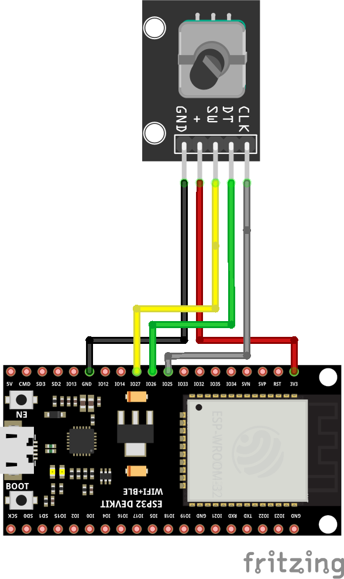

# ESP32 Rotary Encoder
## Circuit


## Code
```c++
#define ENCODER_CLK 25
#define ENCODER_DT  26
#define ENCODER_SW  27

typedef struct{
  byte data;
  int encoderValue = 0;
  int toggleState = 1;
  int lastClkState = 0;
}Encoder;

Encoder encoder1;

// Belirli bir bitin değerini okumak için fonksiyon
bool readBit(uint8_t data, uint8_t bitPosition) {
  if (bitPosition > 7) {
    // Bit pozisyonu 0-7 arasında olmalı
    return false;
  }

  // Belirtilen bitin değerini döndür
  return (data & (1 << bitPosition)) != 0;
}

// Rotary Encoder'dan veri okuma fonksiyonu
void Read_Encoder(Encoder* encoder)
{
  /*
  encoder->data = |A|B|Tg|
  encoder->data = |D|C|Tg|
  olmalıdır.
  */

  // CLK durumu değişmiş mi kontrol et
  if (Read_Bit(encoder->data, 1) != encoder->lastClkState) {
    // DT pininin durumunu kontrol et
    if (Read_Bit(encoder->data, 2) != Read_Bit(encoder->data, 1)) {
      encoder->encoderValue++;
    } else {
      encoder->encoderValue--;
    }
  }
  // Son durumu güncelle
  encoder->toggleState = Read_Bit(encoder->data, 0);
  encoder->lastClkState = Read_Bit(encoder->data, 1);

  //Serial.println(encoder->data, BIN);
}

void setup() {
  Serial.begin(115200);
  
  pinMode(ENCODER_CLK, INPUT);
  pinMode(ENCODER_DT, INPUT);
  pinMode(ENCODER_SW, INPUT_PULLUP);
}

void loop() {
  // Rotary encoder'ı oku ve değerini güncelle
  byte datam = (digitalRead(ENCODER_DT) << 2) + (digitalRead(ENCODER_CLK) << 1) + digitalRead(ENCODER_SW);
  encoder1.data = datam;
  Read_Encoder(&encoder1);

  // Encoder ve Toggle değerlerini seri monitöre yazdır
  Serial.print("Encoder Değeri : ");
  Serial.print(encoder1.encoderValue);
  Serial.print(" - Encoder toggle : ");
  Serial.println(encoder1.toggleState);

  delay(5); // Okuma hızını kontrol etmek için kısa bir gecikme
}
```
